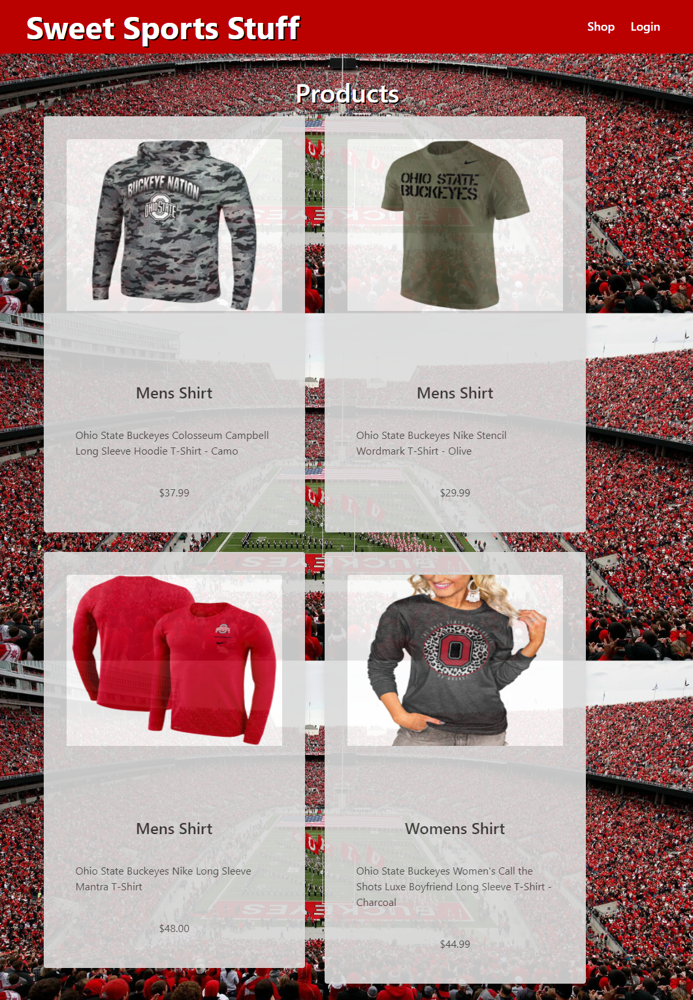
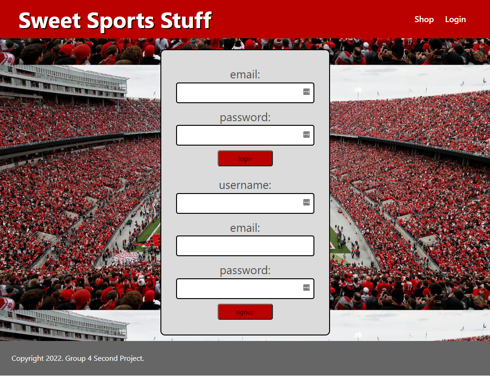
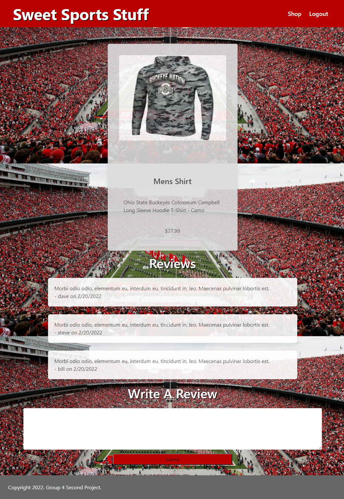

 </a>

<h1 align="center">Sweet Sports Stuff</h1>

---

## 

- [About](#about)
- [Usage](#usage)
- [Built With](#built_using)
- [Authors](#authors)
- [Questions](#questions)
- [Screenshots](#screenshots)

## 

Sweet Sports Stuff is an ecommerce website dedicated to The Ohio State University apparel.

## 

- Deployed at Heroku: https://arcane-reef-45830.herokuapp.com/

- When visiting Sweet Sports Stuff website you are presented with a homepage that displays all the products. Clicking on login will take you to a login page to allow you to login or sign up. Once logged in you will be redirected back to the home page. If a product card is clicked you are then taken to a product detail page with a list of product reviews and a form to write a review. Clicking logout will log you out and take you back to the homepage.

## 

- Node.js
- Express.js
- MySQL
- Sequelize
- Handlebars
- CSS
- Bulma
- Javascript

## 

- [glenluersman](https://github.com/glenluersman)

- [cleancodequeen](https://github.com/cleancodequeen)

- [ileachy](https://github.com/ileachy)

- [ShatteredChungus](https://github.com/ShatteredChungus)

## 

- Feel free to open an issue or contact any of the collaborators if you have any questions about the repo.

## 

</a>

</a>

</a>
